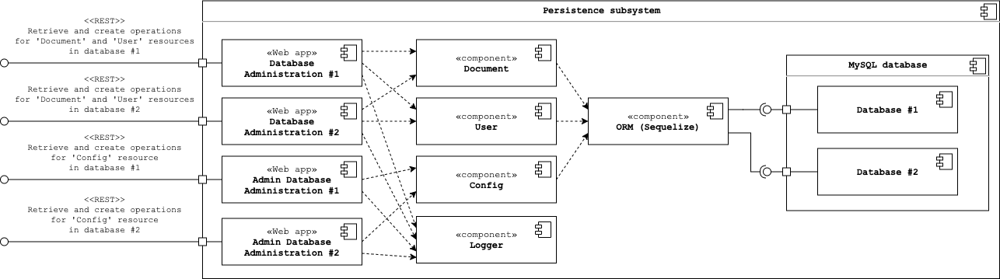

# Persistence Subsystem

This repository contains the source code and configuration of the persistence subsystem to be deployed on a server.  
The different components of the subsystem is run in Docker containers and orchestration by the
[Docker Compose tool](https://docs.docker.com/compose/).  
A UML component diagram illustrating all components and their dependencies is shown below:

## Application

### REST API documentation

An OpenAPI specification of the REST API of database administration web apps can be found
[here](https://app.swaggerhub.com/apis-docs/gucl-bachelor/db-administration-web-app/1.0.0).

The following routes maps to the following components:

-   `/api/documents`, `/api/users`: _Database Administration_
-   `/api/config`: _Admin Database Administration_

### Ports

The application accepts incoming HTTP traffic on following ports:

-   **Database Administration #1**:

    -   Production: 8080
    -   Development: 5000

-   **Admin Database Administration #1**:

    -   Production: 8081
    -   Development: 5001

-   **Database Administration #2**:

    -   Production: 9080
    -   Development: 6000

-   **Admin Database Administration #2**:
    -   Production: 9081
    -   Development: 6001

## Prerequisites

In order to build and run the application locally on your machine, the following requirements must be met:

-   **OS**: macOS or Linux (tested on macOS 15.05.5 and Ubuntu 18.04.4).
-   **Software**:
    -   [GNU Make](https://www.gnu.org/software/make/) (version >= 3.81).
    -   [Docker](https://docs.docker.com/install/) (version >= 19.03.8).
    -   [Docker Compose](https://docs.docker.com/compose/install/) (version >= 1.26.0).
    -   (Optionally) [AWS CLI](https://docs.aws.amazon.com/cli/latest/userguide/install-cliv2.html) (version >= 2.0)
        for pushing artifacts to this project's Docker image registry.
    -   (Optionally) [s3cmd](https://s3tools.org/s3cmd) (version >= 2.1.0)
        for pushing artifacts to this project's object storage.

## Developing Locally

Execute the following commands in this directory to build, setup, and start the application:

1. Migrate DB: `make migrate-db-local`.
2. Build and start application: `make dev`.  

[Nodemon](https://github.com/remy/nodemon), that is enabled by default, automatically restarts the application when
file changes in the directory are detected. Thus, there is no need to rerun the `make dev` command whenever changes
are made to application code.

## Connecting to Logging Subsystem
This setup can automatically connect to the [logging](https://github.com/gucl-bachelor-project/logging-app) subsystem,
while running it locally on your machine, as external Docker network references is set up to the other setups.

## Build and Publish Artifacts
Execute the following commands in this directory to build and publish artifacts for production use: `make prod-build`
and `make prod-push`.  
As of now, the artifacts are published to this project's Docker image registry and object storage.
