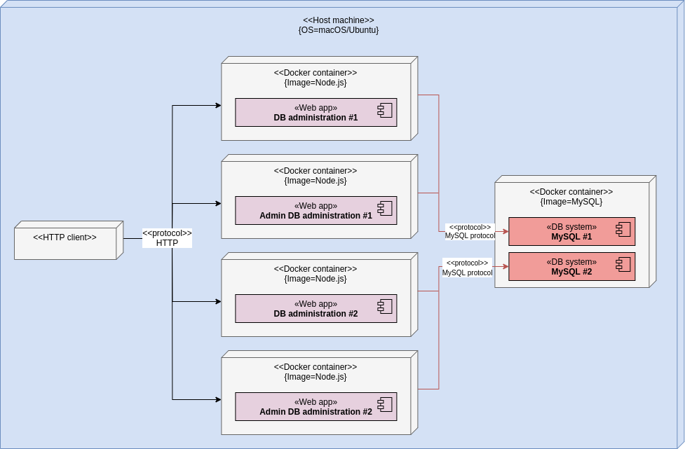

# DB access application

This project contains the full DB access application.

## High level overview of components

## Application

### REST API documentation

An OpenAPI specification of the REST API can be found here:
https://app.swaggerhub.com/apis-docs/gucl-bachelor/db-access-app/1.0.0

The following routes maps to the following components:

-   `/api/documents`, `/api/users`: DB administration
-   `/api/config`: Admin DB administration

### Ports

The application accepts incoming HTTP traffic on following ports:

-   **DB administration #1**:

    -   Production: 8080
    -   Development: 5000

-   **Admin DB administration #1**:

    -   Production: 8081
    -   Development: 5001

-   **DB administration #2**:

    -   Production: 9080
    -   Development: 6000

-   **Admin DB administration #2**:
    -   Production: 9081
    -   Development: 6001

## Installation prerequisites

In order to build and run the application locally on your machine, the following requirements must be met:

-   **OS**: macOS or Linux (tested on macOS 15.04 and Ubuntu 18.04.4).
-   **Software**:
    -   [GNU Make](https://www.gnu.org/software/make/) (version 3.81 =<).
    -   [Docker](https://docs.docker.com/install/) (version 19.03.8 =<).
    -   [Docker Compose](https://docs.docker.com/compose/install/) (version 1.25.3 =<).
    -   (Optionally) [AWS CLI](https://docs.aws.amazon.com/cli/latest/userguide/install-cliv2.html) (version 2.0 =<) for pushing artifacts to this project's Docker image registry and object storage.

## Developing locally

Execute the following commands in this directory to build, setup, and start the application:

1. Migrate DB: `make migrate-db-local`
2. Build and start application: `make dev`.  

[Nodemon](https://github.com/remy/nodemon), that is enabled by default, automatically restarts the application when file changes in the directory are detected. Thus, there is no need to rerun the `make dev` command whenever changes are made to application code.

## Connecting to logging applications
This setup can automatically connect to the [logging](https://github.com/gucl-bachelor-project/logging-app) application, while running it locally on your machine, as external Docker network references is set up to the other setups.

## Build and publish production build

Execute the following commands in this directory to build and publish artifacts for production use: `make prod-build` and `make prod-push`.  
As of now, the artifacts are published to this project's Docker image registry and object storage.
